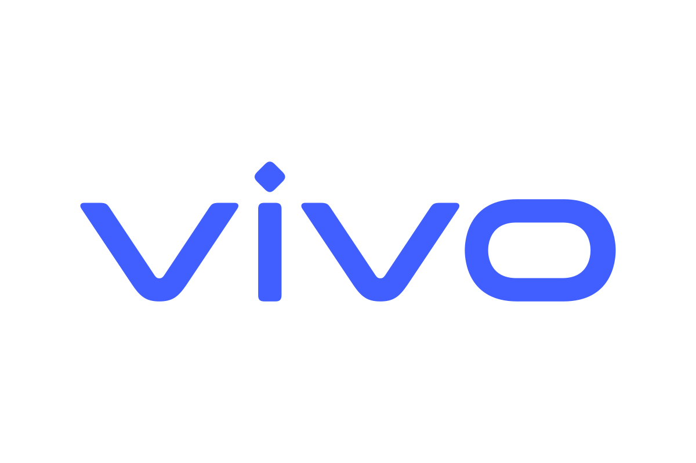

## About Me

My name is Muyu Liu (柳沐雨 in Chinese). I am currently pursuing an M.S. degree in Computer Science and Technology at [ShanghaiTech University](https://www.shanghaitech.edu.cn/) in Shanghai, China. Before that, I received my B.E. degree in Software Engineering from [Shandong University](https://www.sdu.edu.cn/) in Jinan, China, in 2024.

<aside class="job-opportunities" aria-label="Job opportunities">
  
<strong>Job Opportunities</strong>

  
I am seeking full-time opportunities for the 2027 graduating class in <strong>autoregressive video generation</strong> and <strong>interactive world models</strong>.

</aside>

## Research Interests

- Diffusion Models
<!-- - Inverse Problems -->
- Autoregressive Video Generation
- KV Cache Compression

## News

- **[May 2026]** Two papers accepted to **ICML 2026**!



## Education

  

  

    
<strong>ShanghaiTech University</strong> · Shanghai, China

    
Master’s in Computer Science and Technology

    
September 2024 – June 2027 (expected)

  

  

  

    
<strong>Shandong University</strong> · China

    
Bachelor’s in Software Engineering

    
September 2020 – June 2024

  

## Experience

  

  

    
<strong>Research Intern · vivo</strong>

    
BlueImage Lab

    
May 2026 – October 2026

  

<!-- **Generative Image Enhancement with Physical Consistency**  
June 2025 – February 2026

Developed diffusion-based methods for low-light enhancement, HDR reconstruction, and low-field MRI enhancement. This work combines structured forward operator modeling with observation-consistency guidance, and explores dual-variable coupling for robust reconstruction. -->


